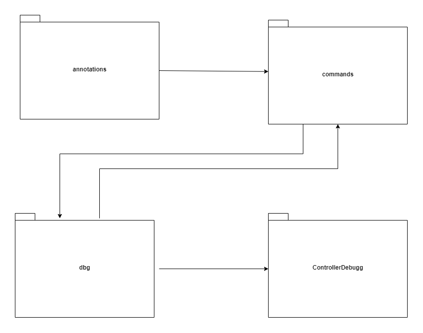
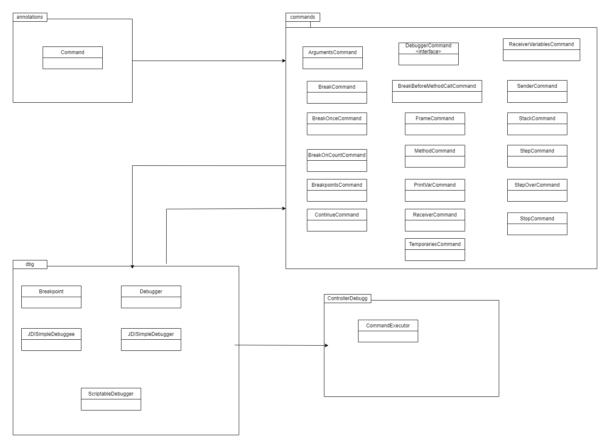
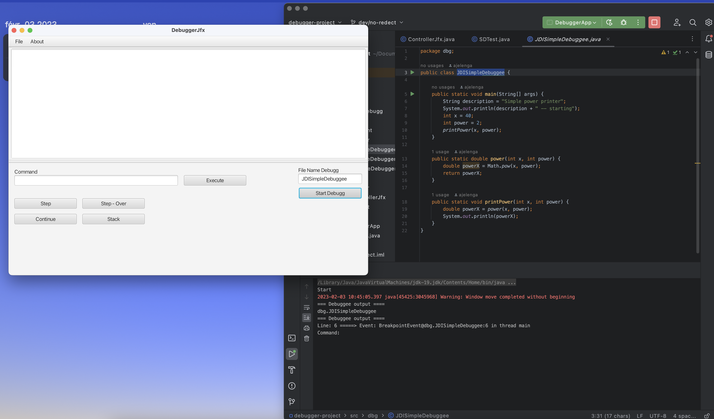

## Architecture du projet

Nous avons 4 packages:

<ul>
    <li> annotations</li>
<h>Dans ce package on a l'annotation Command (interface).</h>
    <li> commands</li>
<h>Dans ce package on a toutes les commandes demandées.</h>
    <li> ControllerDebugg</li>
<h>Dans ce package on a la classe qui permet de d'executer les commandes en fonction de l'action de l'utilisateur.</h>
    <li> dbg</li>
<h>Dans ce packages on a les clsses qui permettent d'initialiser le debugger.</h>
</ul>

## Versions du projet

On a remis deux versions du projet qui s'exécute chaque dans workspace.

- **debugger-project-interface-terminal**
- **debugger-project-interface-redirection**

<ul>
    <li> v1 debugger-project-interface-terminal : Elle a une interface, sur cette interface, on a un champ pour mettre le nom de classe du fichier que l'on veut débugger, cette version s'exécute en ligne de commande (fonctionne correctement).</li>
</ul>

<ul>
    <li> v2 debugger-project-interface-redirection : Elle a une interface, on a un champ pour mettre le nom de classe du fichier que l'on veut débugger et sur cette version l'utilisateur interagit avec le debugger à partir de l'interface, mais celle-ci ne fonctionne pas bien et la fonction Step à été mis par défaut. L'exécution du programme, le débuggeur se lance et s'affiche au niveau de l'interface.</li>
</ul>

## Lancement du projet

Le lancement du projet se fait à partir de la class <strong>DebuggerApp</strong> dans le package jfx.sample.

## Auteurs

- **ELENGA Alphonse Junior**
- **Boukhalfa OUAKSEL**
